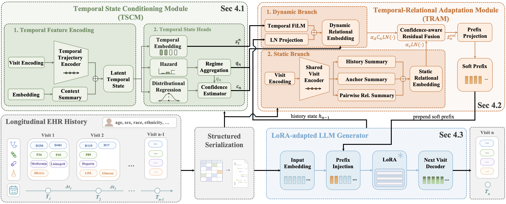

# Anonymous Submission Repository



This repository contains the code, configuration, and training scripts for an anonymous submission on longitudinal EHR synthesis. The implementation follows a three-stage pipeline:

1. Stage 1 trains a LoRA-adapted autoregressive generator for next-visit prediction.
2. Stage 2 trains a temporal state and confidence module on step-wise patient trajectories.
3. Stage 3 trains a relation adapter that injects structured temporal and relational signals back into the generator.

## Repository Layout

```text
SynEHR/
├── environment.yml
├── data/
│   └── README.md
├── scripts/
│   ├── train_stage1_base.py
│   ├── train_stage2_tscm.py
│   ├── train_stage3_tram.py
│   └── generate.py
└── synehr/
    ├── data/
    │   ├── code_encoding.py
    │   ├── dataset.py
    │   ├── serialization.py
    │   └── time_bins.py
    ├── models/
    │   ├── backbone.py
    │   ├── tram.py
    │   └── tscm.py
    └── utils/
        └── adapter_utils.py
```

## Environment

Create the environment with:

```bash
conda env create -f environment.yml
conda activate synehr
```

The codebase depends on `torch`, `transformers`, `peft`, `datasets`, `accelerate`, and standard scientific Python packages listed in `environment.yml`.

## Data

Two data forms are used by the training and inference scripts.

1. `dataset-dir`

   A locally preprocessed dataset directory stored in Hugging Face Datasets format and loadable with `datasets.load_from_disk(...)`. This is used by:

   - `scripts/train_stage1_base.py`
   - `scripts/generate.py`

2. `train.jsonl` and `test.jsonl`

   Step-wise raw trajectory files used by:

   - `scripts/train_stage2_tscm.py`
   - `scripts/train_stage3_tram.py`

In addition, Stage 2, Stage 3, and adapter-based generation require a directory containing `code_vocabs.json`.

See [`data/README.md`](data/README.md) for expected data formats and external access notes.

## Training

### Stage 1: Base Generator

Train the LoRA generator with step-wise supervision:

```bash
python scripts/train_stage1_base.py \
  --backbone llama31 \
  --dataset-dir /path/to/hf_dataset \
  --output-root /path/to/outputs/stage1 \
  --mode step
```

Key outputs under `--output-root`:

- `checkpoint-epoch*/`
- `best/`
- `training_log.csv`
- `run_metadata.json`

### Stage 2: Temporal Module

Train the temporal state and confidence module:

```bash
python scripts/train_stage2_tscm.py \
  --backbone llama31 \
  --ckpt /path/to/outputs/stage1/best \
  --stage1-ckpt /path/to/stage1_embeddings.pt \
  --stage1-data-dir /path/to/stage1_data \
  --train-jsonl /path/to/train.jsonl \
  --test-jsonl /path/to/test.jsonl \
  --output-root /path/to/outputs/stage2
```

Key outputs under `--output-root`:

- `epoch_*.pt`
- `best.pt`
- `training_log.csv`
- `run_metadata.json`

### Stage 3: Relation Adapter

Train the relation-aware prefix adapter:

```bash
python scripts/train_stage3_tram.py \
  --backbone llama31 \
  --lora /path/to/outputs/stage1/best \
  --tscm-ckpt /path/to/outputs/stage2/best.pt \
  --stage1-ckpt /path/to/stage1_embeddings.pt \
  --stage1-data-dir /path/to/stage1_data \
  --train-jsonl /path/to/train.jsonl \
  --test-jsonl /path/to/test.jsonl \
  --output-root /path/to/outputs/stage3
```

Key outputs under `--output-root`:

- `epoch_*.pt`
- `best.pt`
- `training_log.csv`
- `run_metadata.json`

## Inference

Generate longitudinal visits with the trained base model only:

```bash
python scripts/generate.py \
  --backbone llama31 \
  --ckpt /path/to/outputs/stage1/best \
  --dataset-dir /path/to/hf_dataset \
  --output /path/to/generation_base.jsonl \
  --rollout-split test
```

Generate with the full adapter stack:

```bash
python scripts/generate.py \
  --backbone llama31 \
  --ckpt /path/to/outputs/stage1/best \
  --dataset-dir /path/to/hf_dataset \
  --adapter-ckpt /path/to/outputs/stage3/best.pt \
  --adapter-meta /path/to/outputs/stage3/run_metadata.json \
  --tscm-ckpt /path/to/outputs/stage2/best.pt \
  --stage1-data-dir /path/to/stage1_data \
  --output /path/to/generation_full.jsonl \
  --rollout-split test
```

Optional generation controls include:

- `--n-eval`
- `--max-new-tokens`
- `--max-visits`
- `--do-sample`
- `--temperature`
- `--top-p`
- `--rep-penalty`

## Notes

- Access to the selected backbone model must be available in the local runtime environment.
- The repository does not redistribute any restricted clinical data.
- All paths above are placeholders and should be replaced with local paths in your environment.
