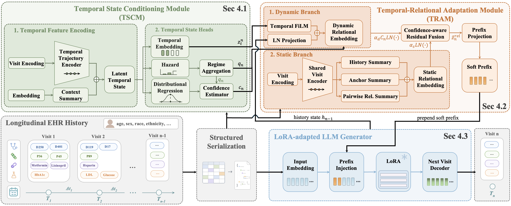

# [CIKM 2026] SynEHR: Joint Modeling Inter-visit Temporal Evolution and Intra-visit Clinical Structure for Longitudinal EHR Synthesis

<p align="center">
  <a href="https://arxiv.org/abs/2608.21673">Paper</a> |
  <a href="https://doi.org/10.1145/3799682.3840734">DOI</a> |
  <a href="https://cikm2026.diag.uniroma1.it/">CIKM 2026</a>
</p>

**Authors:** Ximiao Li, Lin Jiang, Rongchao Xu, Dahai Yu, Zhe He, and Guang Wang

## News

- **September 2026:** 📰 The SynEHR preprint became available on [arXiv](https://arxiv.org/abs/2608.21673).
- **August 2026:** 🎉 SynEHR was accepted to the 35th ACM International Conference on Information and Knowledge Management (CIKM 2026).

## Overview

SynEHR is a lightweight adaptive LLM framework for longitudinal electronic health record (EHR) synthesis. It jointly models irregular temporal evolution across visits and structured clinical relationships within each visit to generate patient trajectories that are more temporally faithful and clinically coherent.

The framework uses a three-stage pipeline:

1. **Base generator:** train a LoRA-adapted autoregressive language model for next-visit prediction.
2. **Temporal State Conditioning Module (TSCM):** learn temporal states and confidence signals from step-wise patient trajectories.
3. **Temporal-Relational Adaptation Module (TRAM):** combine temporal states with patient history and inject patient-specific relational representations into the generator.



## Repository Layout

```text
SynEHR/
├── environment.yml
├── data/
│   └── README.md
├── scripts/
│   ├── train_stage1_base.py
│   ├── train_stage2_tscm.py
│   ├── train_stage3_tram.py
│   └── generate.py
└── synehr/
    ├── data/
    │   ├── code_encoding.py
    │   ├── dataset.py
    │   ├── serialization.py
    │   └── time_bins.py
    ├── models/
    │   ├── backbone.py
    │   ├── tram.py
    │   └── tscm.py
    └── utils/
        └── adapter_utils.py
```

## Installation

Create the environment with Conda:

```bash
conda env create -f environment.yml
conda activate synehr
```

Alternatively, install the Python dependencies with pip:

```bash
pip install -r requirements.txt
```

The codebase depends on `torch`, `transformers`, `peft`, `datasets`, `accelerate`, and the scientific Python packages listed in `environment.yml` and `requirements.txt`.

## Data

This repository does not redistribute restricted source EHR data. Please follow the instructions in **[data/README.md](data/README.md)** for official MIMIC-III and MIMIC-IV access, expected local data formats, and required preprocessing artifacts.

## Training

### Stage 1: Base Generator

Train the LoRA generator with step-wise supervision:

```bash
python scripts/train_stage1_base.py \
  --backbone llama31 \
  --dataset-dir /path/to/hf_dataset \
  --output-root /path/to/outputs/stage1 \
  --mode step
```

Key outputs under `--output-root`:

- `checkpoint-epoch*/`
- `best/`
- `training_log.csv`
- `run_metadata.json`

### Stage 2: Temporal Module

Train the temporal state and confidence module:

```bash
python scripts/train_stage2_tscm.py \
  --backbone llama31 \
  --ckpt /path/to/outputs/stage1/best \
  --stage1-ckpt /path/to/stage1_embeddings.pt \
  --stage1-data-dir /path/to/stage1_data \
  --train-jsonl /path/to/train.jsonl \
  --test-jsonl /path/to/test.jsonl \
  --output-root /path/to/outputs/stage2
```

Key outputs under `--output-root`:

- `epoch_*.pt`
- `best.pt`
- `training_log.csv`
- `run_metadata.json`

### Stage 3: Relation Adapter

Train the relation-aware prefix adapter:

```bash
python scripts/train_stage3_tram.py \
  --backbone llama31 \
  --lora /path/to/outputs/stage1/best \
  --tscm-ckpt /path/to/outputs/stage2/best.pt \
  --stage1-ckpt /path/to/stage1_embeddings.pt \
  --stage1-data-dir /path/to/stage1_data \
  --train-jsonl /path/to/train.jsonl \
  --test-jsonl /path/to/test.jsonl \
  --output-root /path/to/outputs/stage3
```

Key outputs under `--output-root`:

- `epoch_*.pt`
- `best.pt`
- `training_log.csv`
- `run_metadata.json`

## Inference

Generate longitudinal visits with the trained base model only:

```bash
python scripts/generate.py \
  --backbone llama31 \
  --ckpt /path/to/outputs/stage1/best \
  --dataset-dir /path/to/hf_dataset \
  --output /path/to/generation_base.jsonl \
  --rollout-split test
```

Generate with the full adapter stack:

```bash
python scripts/generate.py \
  --backbone llama31 \
  --ckpt /path/to/outputs/stage1/best \
  --dataset-dir /path/to/hf_dataset \
  --adapter-ckpt /path/to/outputs/stage3/best.pt \
  --adapter-meta /path/to/outputs/stage3/run_metadata.json \
  --tscm-ckpt /path/to/outputs/stage2/best.pt \
  --stage1-data-dir /path/to/stage1_data \
  --output /path/to/generation_full.jsonl \
  --rollout-split test
```

Optional generation controls include:

- `--n-eval`
- `--max-new-tokens`
- `--max-visits`
- `--do-sample`
- `--temperature`
- `--top-p`
- `--rep-penalty`

## Notes

- Access to the selected backbone model must be available in the local runtime environment.
- The repository does not redistribute any restricted clinical data.
- All paths above are placeholders and should be replaced with local paths in your environment.

## Citation

If you find SynEHR useful in your research, please cite our paper:

```bibtex
@inproceedings{li2026synehr,
  title     = {{SynEHR}: Joint Modeling Inter-visit Temporal Evolution and Intra-visit Clinical Structure for Longitudinal {EHR} Synthesis},
  author    = {Li, Ximiao and Jiang, Lin and Xu, Rongchao and Yu, Dahai and He, Zhe and Wang, Guang},
  booktitle = {Proceedings of the 35th ACM International Conference on Information and Knowledge Management},
  year      = {2026},
  doi       = {10.1145/3799682.3840734},
  url       = {https://doi.org/10.1145/3799682.3840734}
}
```
